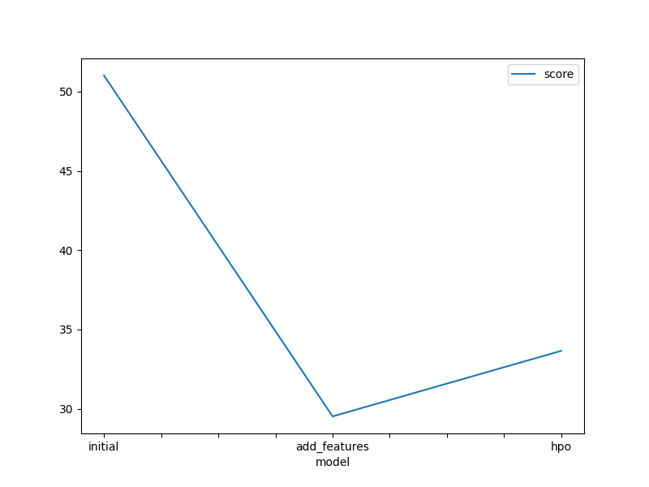
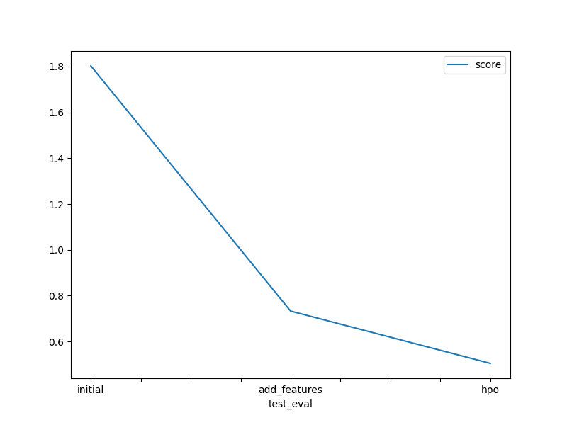

# Report: Predict Bike Sharing Demand with AutoGluon Solution
#### Suyash Mullick

## Initial Training
### What did you realize when you tried to submit your predictions? What changes were needed to the output of the predictor to submit your results?
Kaggle does not accept negative prediction values, so I had to clip any negative values if they existed.
However there were no such values, but I added the code for clipping them if they existed anyway so that it can be
reused for other datasets.

### What was the top ranked model that performed?
The top ranked model was the

## Exploratory data analysis and feature creation
### What did the exploratory analysis find and how did you add additional features?
Through the exploratory data analysis I converted the season and weather features to the category data type. This way 
models treat them properly as categories which in turn improves model performance. I added the additional 'hour' feature, since it seemed to be pretty important and useful feature for predicting bike demand. I extracted the hour feature from the already provided datetime.

### How much better did your model preform after adding additional features and why do you think that is?
My initial model got a kaggle score of 1.80244, while my new model got the score 0.73302. This model performed significantly better with just the addition of 1 feature (hour). This is because the hour feature provides a lot of
detail into the bike usage and thus consequently sharing demand. E.g., the demand will obviously be less at 2:00 than
at 16:00.

## Hyper parameter tuning
### How much better did your model preform after trying different hyper parameters?
Initially I set the `hyperparameters_tuning_kwargs` parameter to "auto" and it produced a result with the score: 0.63648. Then I manually chose the parameters and set the `time_limit` to 900, `num_boost_rounds` to 100, and `num_epochs` to 5 which then resulted in the score 0.50493.

### If you were given more time with this dataset, where do you think you would spend more time?
I would add more features, while experimenting with removing features if needed to reduce overfitting if there is any.

### Create a table with the models you ran, the hyperparameters modified, and the kaggle score.
|model|time_limit|num_boost_rounds|num_epochs|score|
|--|--|--|--|--|
|initial|600|default|default|1.80244|
|add_features|600|default|default|0.73302|
|hpo|900|100|5|0.50493|

### Create a line plot showing the top model score for the three (or more) training runs during the project.

### Create a line plot showing the top kaggle score for the three (or more) prediction submissions during the project.

## Summary
This project was a fun and great learning experience for me. I expiremented with various TabularPredictors to predict bike sharing demand starting with a baseline model. I achieved modest results, but performance improved significantly after adding the hour feature and converting season and weather to categorical types. Hyperparameter tuning further boosted performance, with a manually tuned model reaching a Kaggle score of 0.50493. The results show how both feature engineering and targeted tuning can greatly enhance model accuracy. Given more time, I would focus on creating more features and optimizing model simplicity to prevent overfitting.
